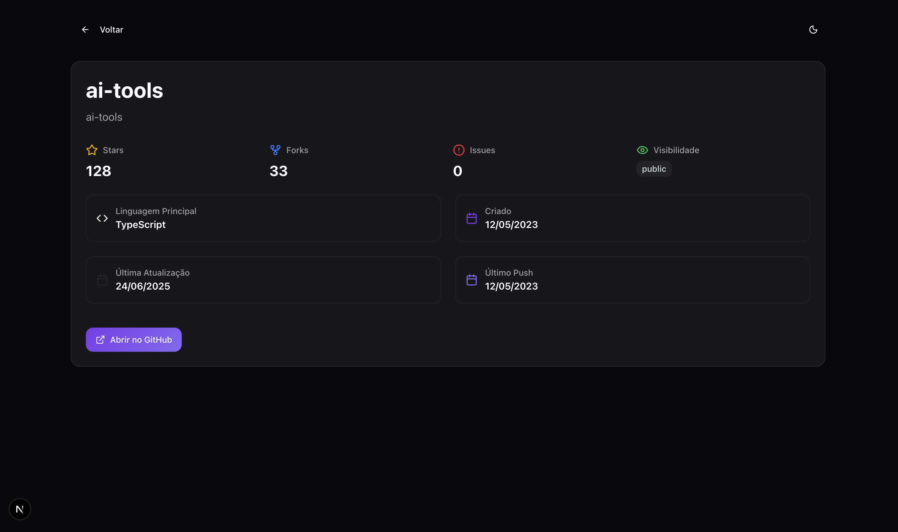

# Teste Prático - Desenvolvedor Frontend React/Next.js

## Gitview - consulta de usuários e repositórios Github

## 🎯 Objetivo

Este teste prático tem como objetivo avaliar suas habilidades técnicas em desenvolvimento frontend, especificamente:

- **Desenvolvimento com Design Atômico**: Estruturação clara e organizada de componentes
- **Boas práticas React/Next.js**: Performance, organização e código limpo
- **Uso eficiente de Hooks**: Aplicação correta de hooks nativos e personalizados
- **Implementação de Cache**: Estratégias eficientes para otimização de API calls
- **Testes Unitários**: Cobertura adequada e qualidade dos testes

## 📋 Especificações do Projeto

### Tecnologias Obrigatórias

- **Framework**: Next.js (versão 13+ recomendada)
- **Linguagem**: TypeScript
- **API**: GitHub Public API (`https://api.github.com`)
- **Cache**: SWR, React Query (TanStack Query) ou soluções nativas do Next.js
- **Testes**: Jest + React Testing Library

### Funcionalidades Requeridas

#### 1. Página de Listagem de Repositórios

- **Endpoint**: `https://api.github.com/users/{username}/repos`
- **Funcionalidades**:
  - Input para inserir username do GitHub
  - Listagem dos repositórios públicos do usuário
  - Exibição de informações básicas: nome, descrição, linguagem principal
  - Paginação ou carregamento otimizado
  - Estados de loading, erro e dados vazios

#### 2. Página de Detalhes do Repositório

- **Endpoint**: `https://api.github.com/repos/{owner}/{repo}`
- **Informações obrigatórias**:
  - Nome do repositório
  - Descrição completa
  - Número de estrelas
  - Número de forks
  - Issues abertas
  - Linguagem principal
  - Data de criação e última atualização
  - Link para o repositório no GitHub

## 🏗️ Estrutura do Projeto (Design Atômico)

```
src/
├── app/
│   └── repository/     # Página de detalhes do repositório selecionado
├── components/
│   ├── atoms/           # Elementos básicos (Button, Input, Text, Icon)
│   ├── molecules/       # Combinações de átomos (SearchBox, RepoCard)
│   ├── organisms/       # Grupos complexos (RepoList, Header, Footer)
│   ├── templates/       # Layouts de página
│   └── pages/          # Páginas completas
├── hooks/              # Custom hooks
├── services/           # Serviços de API
├── types/              # Definições TypeScript
├── utils/              # Funções utilitárias
└── __tests__/          # Testes organizados por componente
```

## ⚡ Requisitos Técnicos

### 1. Design Atômico

- [x] Separação clara entre átomos, moléculas, organismos, templates e páginas
- [x] Componentes reutilizáveis e bem documentados
- [x] Props tipadas com TypeScript
- [x] Storybook é um diferencial (opcional)

### 2. Boas Práticas React/Next.js

- [x] Uso de Server Components quando apropriado
- [x] Implementação de Error Boundaries
- [x] Otimizações de performance (useMemo, useCallback quando necessário)
- [x] SEO básico (meta tags, títulos dinâmicos)
- [x] Responsividade mobile-first

### 3. Hooks do React

- [x] **useState**: Gerenciamento de estado local
- [x] **useEffect**: Efeitos colaterais e lifecycle
- [x] **useContext**: Compartilhamento de estado global (se necessário)
- [x] **Custom Hooks**: Criação de pelo menos 1 hook personalizado
- [x] **useMemo/useCallback**: Otimizações quando apropriado

### 4. Implementação de Cache

Escolha uma das opções e implemente corretamente:

#### React Query (TanStack Query)

```typescript
import { useQuery } from "@tanstack/react-query";

const {
  data: user,
  error: userError,
  isFetching: userLoading,
} = useQuery({
  queryKey: ["user", username],
  queryFn: () => getGithubUser(username),
  enabled: false,
});

const {
  data: repositories,
  error: repositoriesError,
  isFetching: reposLoading,
} = useQuery({
  queryKey: ["repos", username],
  queryFn: () => getGithubRepositories(username),
  enabled: !!user,
});
```

### 5. Testes Unitários

- [x] **Mínimo obrigatório**:
  - 2 componentes atômicos testados
  - 1 funcionalidade principal (busca de repositórios)
  - 1 custom hook testado
- [x] **Cobertura**: Testes de renderização, interação e estados
- [x] **Mocks**: APIs mockadas adequadamente
- [x] **Casos de teste**: Happy path, loading, error states

````markdown
## 📝 Descrição

Foi implmentado todas as funcionalidades pedidas. O design do projeto segue em um tom moderno e dark com a opção de tema light.

Como funciona: No input inicial o usuário insere o username do perfil github e, se encontrado, será mostrado dois card, um de usuário e outro com a listagem dos repositórios.

Há cobertura para caso o usuário não tenha sido encontrado, caso não tenha repositórios e caso esteja com acesso negado pela api do github.

## ✅ Checklist de Requisitos

- [x] Design Atômico implementado
- [x] Hooks do React utilizados adequadamente
- [x] Cache implementado (especificar qual: SWR/React Query/Next.js)
- [x] Testes unitários incluídos
- [x] TypeScript configurado
- [x] Responsividade implementada

## 🧪 Testes

- Total de testes: 9
- Componentes testados: [button, input]
- Hooks testados: [userSearchFilter]
- Cobertura estimada: 100%

## 🚀 Como executar

```bash
# Comandos para instalar e executar
npm install
npm run dev
npm run test
```
````

## 📱 Screenshots




## 🔧 Decisões Técnicas

Explique brevemente suas principais decisões arquiteturais:

- **Por que escolheu determinada biblioteca de cache**: Já utilizo as bibliotecas e extensões da Tanstack em muitos projetos com NextJs, então possuindo familiridade resolvi adota-la. O funcionado o gerenciamento de dados em cache e as atualizações sem alteração na arvore inteira ou ate mesmo em todo os dados de um objeto/array são um fator crucial.

- **Como organizou os componentes atômicos**: Eu utilizei a biblioteca ShadcnUI para ter os atoms, a base de componentes, com algumas adaptações particulares do meu projeto, como as estilizações e comportamento do input. Criei as molecules com a junção de atoms e/ou funcionalidades, usando o conceito de reusabilidade. Os organisms são os componentes mais completos e únicos que muitas vezes são client-side para não compromenter o carregamento server-side da página principal.

- **Desafios encontrados e soluções**: Encontrar uma forma de fazer que tenha uma chamada server-side nesse desafio, a única chamada server-side que foi implementada com utilidade foi a da página de detalhes do repositório. A estruturação em "componentes atômicos" também foi algo novo, até então não utilizei esse tipo de design patterns.

## ⏱️ Tempo Investido

Aproximadamente 10 horas

```

## 📏 Critérios de Avaliação

### 1. Código (60%)
- **Design Atômico**: Estrutura clara e organizada (15%)
- **Boas práticas React/Next.js**: Performance e organização (15%)
- **Hooks**: Uso adequado e eficiente (10%)
- **Cache**: Implementação eficiente e clara (10%)
- **Testes**: Cobertura e qualidade (10%)

### 2. Commits (20%)
- Qualidade das mensagens de commit
- Atomicidade dos commits
- Uso de Conventional Commits
- Histórico limpo e organizado

### 3. Documentação (20%)
- Qualidade do Pull Request
- README do projeto
- Comentários no código quando necessário
- Instruções claras de execução

## ⏰ Prazo e Considerações

- **Prazo**: 5 dias úteis após o recebimento
- **Dúvidas**: Podem ser enviadas por email ou Issues no repositório
- **Entrega**: Pull Request conforme instruções acima

## 🎯 Dicas para se Destacar

- **Performance**: Implementar lazy loading, code splitting
- **UX**: Adicionar skeleton loading, animações suaves
- **Acessibilidade**: ARIA labels, navegação por teclado
- **Error Handling**: Tratamento elegante de erros
- **Documentação**: Storybook ou documentação detalhada dos componentes
- **Extra**: Dark mode, filtros avançados, favoritar repositórios

## 📚 Recursos Úteis

- [Next.js Documentation](https://nextjs.org/docs)
- [React Query Documentation](https://tanstack.com/query/latest)
- [SWR Documentation](https://swr.vercel.app/)
- [React Testing Library](https://testing-library.com/docs/react-testing-library/intro)
- [GitHub API Documentation](https://docs.github.com/en/rest)
- [Atomic Design Methodology](https://bradfrost.com/blog/post/atomic-web-design/)

---

**Boa sorte! 🚀**

Estamos ansiosos para ver sua solução e conhecer seu estilo de desenvolvimento!
```
