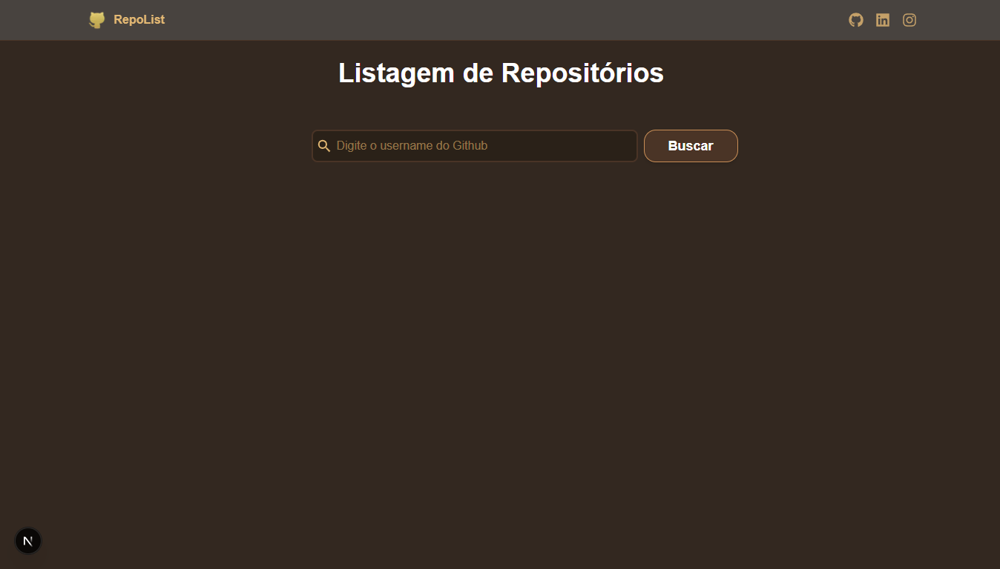
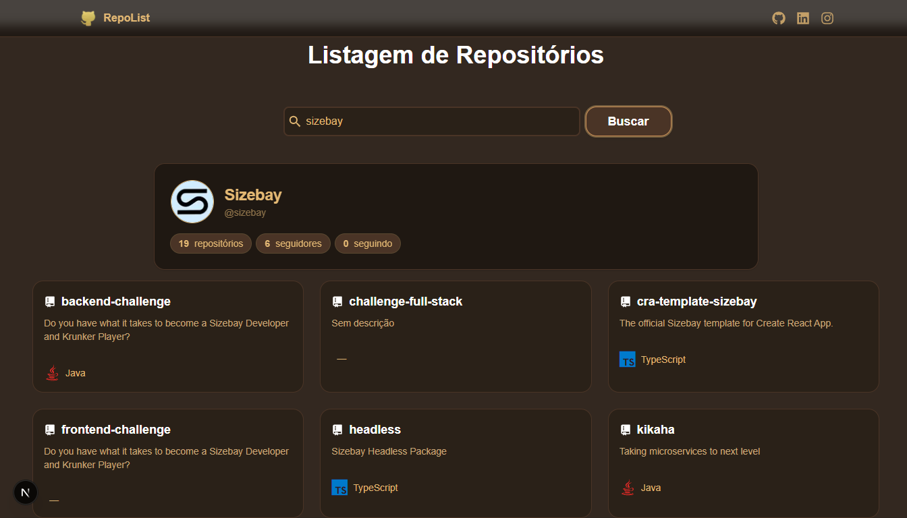
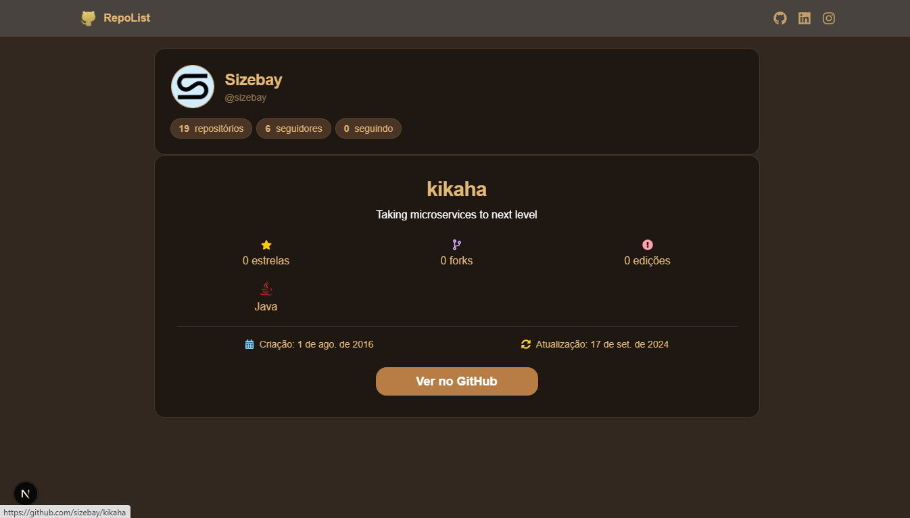
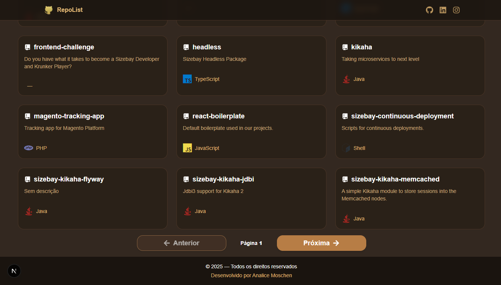

# RepoList — Teste Prático

Aplicação para buscar usuários do GitHub, listar e ver detalhes de repositórios, desenvolvida com **Next.js 13+**, **TypeScript**, **React Query** e arquitetura **Design Atômico**.  
Inclui testes com **Jest + React Testing Library**.

## ✨ Funcionalidades

- **Busca por usuário** com persistência na querystring  
- **Listagem paginada** de repositórios  
- **Perfil do usuário** (avatar, biografia, username, contadores de repositórios, seguidores e seguindo)  
- **Card de repositório** (nome, descrição, ícone da linguagem via Devicon)  
- **Página de detalhes** (estrelas, forks, edições, linguagem, datas de criação/atualização, link do GitHub)  
- **Skeletons** de carregamento e mensagens de erro
- **Cache com React Query** (`staleTime` / `gcTime`)  
- **Design Atômico** (atoms, molecules, organisms, templates)  
- **Responsivo** e com **paleta marrom/dourado**  
- **Navbar e Footer** fixos

## 🧱 Arquitetura (Atomic Design)

src/
├── components/
│ ├── atoms/ # Button, Input, Avatar, Badge, LanguageIcon
│ ├── layout/ # Footer, Navbar
│ ├── molecules/ # RepoCard, RepoCardSkeleton, SearchBox, UserInfo
│ ├── organisms/ # RepoDetails, RepoList, UserProfileCard
│ └── templates/ # MainTemplate
├── hooks/ # useUserRepo, userRepoDetails, userUserProfile
├── services/ # githubAPI
├── types/ # github.ts
└── tests/ # Jest + RTL (atoms, hooks, molecules)

# 🚀 Como rodar

``bash
# Instalar dependências
npm install

# Rodar em modo desenvolvimento
npm run dev

# Abrir no navegador
http://localhost:3000

## 🧠 Decisões Técnicas

Next.js 13+ com App Router
React Query para cache de API GitHub
Paginação habilitada apenas se a página atual vier completa (repos.length === perPage)
Acessibilidade com aria-label e elementos semânticos
Atomic Design para facilitar manutenção e reuso

## 🧪 Testes

Stack: Jest + React Testing Library

2 átomos: Button, Input
1 hook: useUserRepo
1 funcionalidade: SearchBox

## 🖼️ Preview

### Tela inicial

### Lista de repositórios

### Página de detalhes

### Paginação

📌 Observações

- Alguns repositórios podem não informar a linguagem, sendo exibido -.
- Na pasta public/ há outras imagens, incluindo favicon, animações do ícone de busca e animações do card selecionado.
